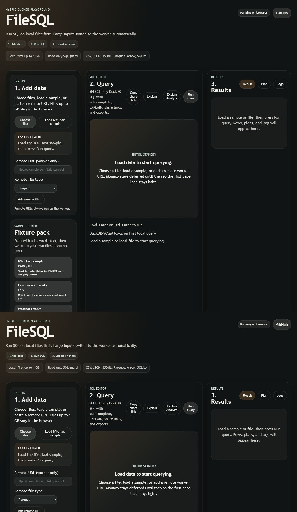
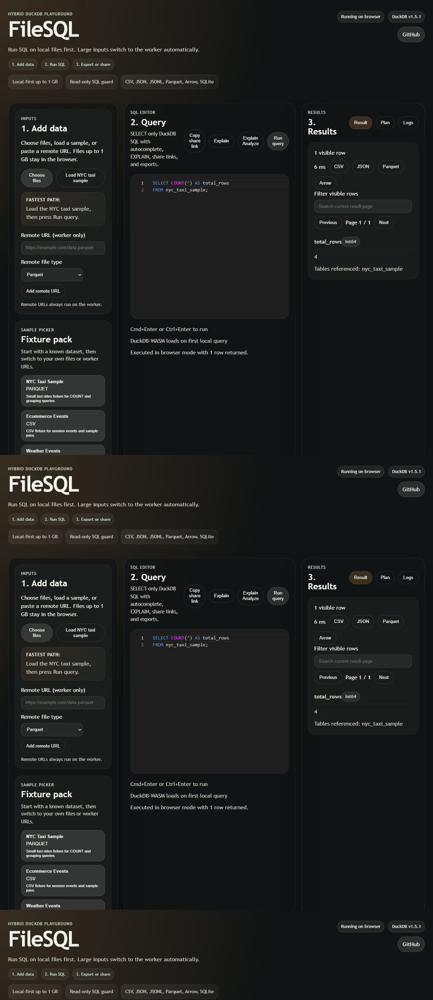

# FileSQL

FileSQL runs DuckDB SQL on CSV, JSON, JSONL, Parquet, Arrow, and SQLite files with a browser-first flow and transparent worker fallback for larger jobs. The app is structured as a hybrid monorepo with a TypeScript core, a Vite/React web UI, and a FastAPI worker for native DuckDB execution.

FileSQL is a DuckDB SQL playground for files: drop CSV, JSON, JSONL, Parquet, Arrow, or SQLite into the browser, run joins and EXPLAIN plans locally, and transparently escalate to a native worker when a file is too large or must be fetched remotely. The goal is quick ad-hoc SQL over files without forcing a database setup or defaulting to cloud upload.

## Screenshots





## Features

- Browser-first DuckDB-WASM execution for files up to 1 GB.
- Transparent worker fallback for oversized files and remote URLs.
- Monaco SQL editor with schema-aware completion and `Cmd`/`Ctrl` + `Enter`.
- Schema panel with sample values, rename, and drop actions.
- Result tabs for results, plans, and logs.
- Read-only SQL enforcement in browser and worker modes.
- Result export as CSV, JSON, Parquet, and Arrow.
- Share links that round-trip SQL through the URL.
- Built-in sample pack for CSV, TSV, JSON, JSONL, Parquet, Arrow, and SQLite.

## Workspace

- `packages/core`: shared engine contracts and browser/worker routing logic.
- `packages/web`: FileSQL playground UI.
- `apps/worker`: FastAPI worker with native DuckDB.

## Local Run

Web:

```bash
pnpm install
pnpm --filter @filesql/web dev -- --host 127.0.0.1 --port 4318
```

Worker:

```bash
cd apps/worker
python -m venv .venv
. .venv/Scripts/activate
pip install -e .[dev]
uvicorn app.main:app --host 127.0.0.1 --port 8000
```

Docker:

```bash
docker compose up --build
```

## Verification

```bash
pnpm typecheck
pnpm test
pnpm build
cd apps/worker && python -m pytest
```

## SEO Routes

- `/sql-on-csv`
- `/sql-on-parquet`
- `/sql-on-jsonl`
- `/sqlite-online-query`
- `/duckdb-online`

## Self-Host

The web app is a static Vite build in `packages/web/dist`. The worker is a FastAPI service and the repo ships `docker-compose.yml` for the hybrid local run path.

For a public worker deployment, the repo now includes `apps/worker/fly.toml` for the PRD-aligned Fly.io target. It publishes the worker on port `8000`, uses `/health` checks, keeps the retention TTL at `10` minutes, enforces HTTPS, and starts from zero machines when idle. The hosted frontend can call that public worker by pasting the worker base URL into the "Remote URL / Worker" panel.

Typical Fly.io flow:

```bash
cd apps/worker
fly launch --no-deploy
fly deploy
```

The repo also keeps a root `render.yaml` for an alternate Docker-backed worker deployment path.

Typical Render flow:

```bash
git add render.yaml apps/worker/fly.toml
git commit -m "Add worker deployment configuration"
git push origin main
```

Then open the repo in Render Blueprint mode and apply the `filesql-worker` service definition from `render.yaml`, or deploy the worker directly from `apps/worker/fly.toml` with Fly.io.

Checked-in UI screenshots live under `docs/screenshots/` so the GitHub README mirrors the current product surface instead of mockups.

## License

- Root repo, `packages/core`, and `packages/web`: MIT.
- `apps/worker`: AGPL-3.0-or-later.
